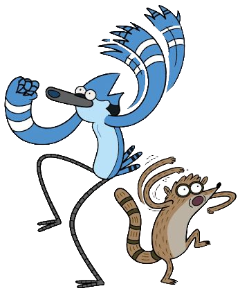
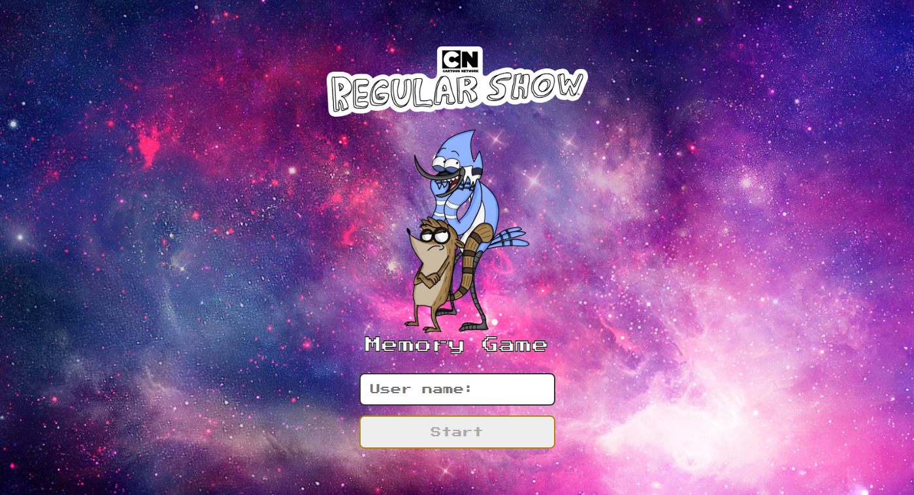
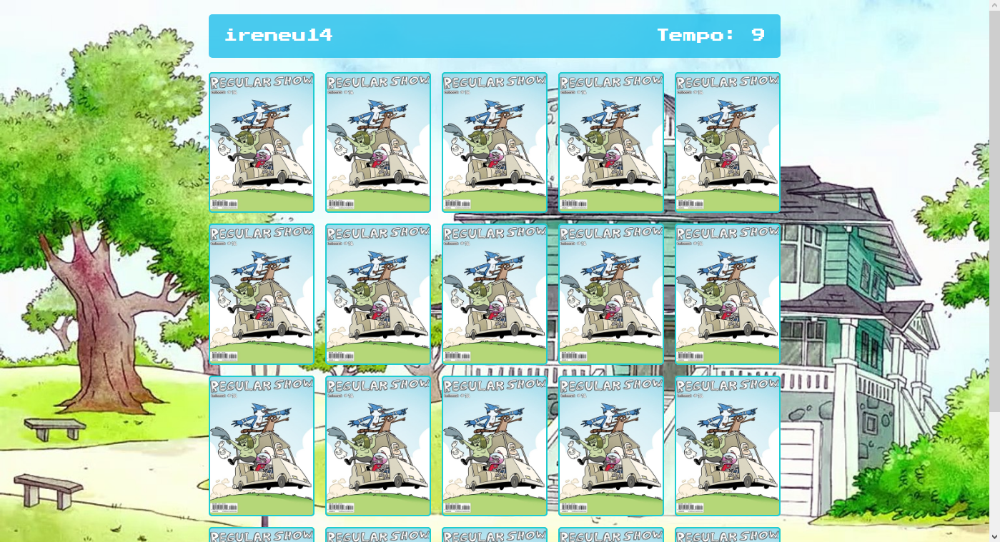

<h1>Jogo da memoria em JS</h1>
 

  

    

  

     <h2> Telas do projeto </h2>
      
        
     
 

   Este projeto tem como objetivo fazer um jogo da memoria tema 'Apenas um show', utilizando JavaScript. 
   O programa na sua primeira tela captura o nick name do usuário através do formulario, e guarda no local 
   strorage do navegador. Na aba em seguida o nick name é exibido no canto superior esquerdo da tela, e ao lado 
   o timer contando o tempo que o jogador irá concluir o jogo, após o usuário acerta todas as cartas o programa 
   exibira uma menssagem de concluido  e o tempo que o usuário levou para finalizar o jogo, além de cada vez que 
   o jogador renicia o game as cartas irão trocar de pocição, assim o jogo se torna mais dinamico e desafiador. 
   Com esse projeto eu pude praticar elementos avançados de css, e lógica de programação complexa. Ao passar do tempo 
   irei ir atualizandio esse projeto. 

    <h2>Tecnologias usadas</h2>  
   
  
    

<a href="https://guidev1.github.io/jogoDaMemoriaJs/">Visualizar Projeto</a>

